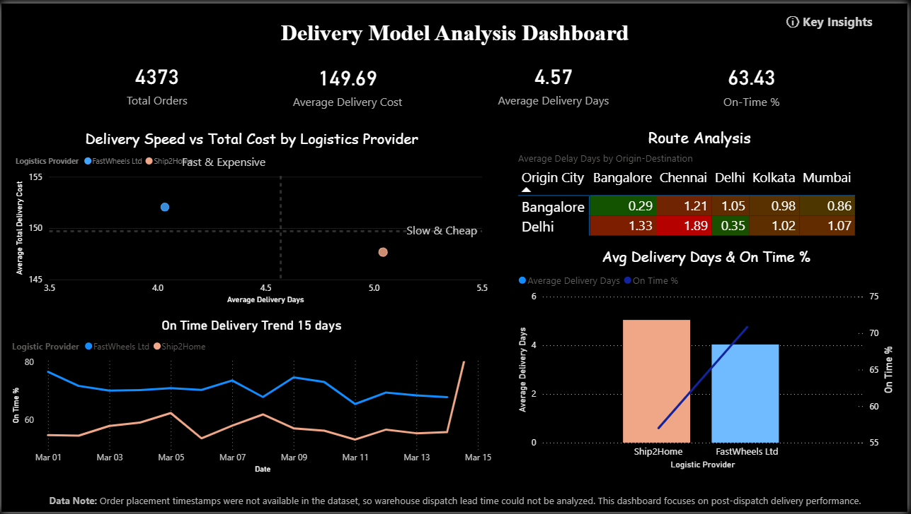

# 🚚 E-commerce Delivery Partner Performance Analysis

## 📌 Overview
This project analyzes delivery performance across two logistics providers for an e-commerce operation, comparing cost, speed, and reliability to support logistics partner decisions.

## 🎯 Objective
- Compare cost vs. delivery speed tradeoffs between logistics providers
- Track on-time delivery performance over time
- Identify route-level delay patterns by origin-destination pair
- Support decisions on logistics partner selection or order-splitting strategy

## 🧠 Key Insights
- 4,373 total orders analyzed | Avg delivery cost ₹149.69 | Avg delivery time 4.57 days | 63.43% on-time
- FastWheels Ltd: faster but more expensive ("Fast & Expensive" quadrant)
- Ship2Home: slower but cheaper ("Slow & Cheap" quadrant)
- On-time delivery % trends diverge over a 15-day period between providers
- Route-level delay hotspots identified (e.g., Bangalore–Chennai: 1.21 avg delay days)

## 📊 Dashboard

## 🛠 Tools Used
- Microsoft Power BI

## ⚠️ Data Note
Order placement timestamps were not available in the source data, so warehouse dispatch lead time could not be analyzed. This dashboard focuses on post-dispatch delivery performance. Raw dataset is not included in this repo (proprietary/sample data); .pbix file is provided for methodology reference.

## 💼 Business Recommendations
- Consider splitting order volume: use FastWheels for time-sensitive/high-value orders, Ship2Home for cost-sensitive bulk orders
- Investigate Bangalore–Chennai and Delhi–Chennai routes for consistent delay causes
- Renegotiate SLAs with providers showing declining on-time trends

## 👤 Author
**Bharat Lalwani**  
Data Science & Analytics
